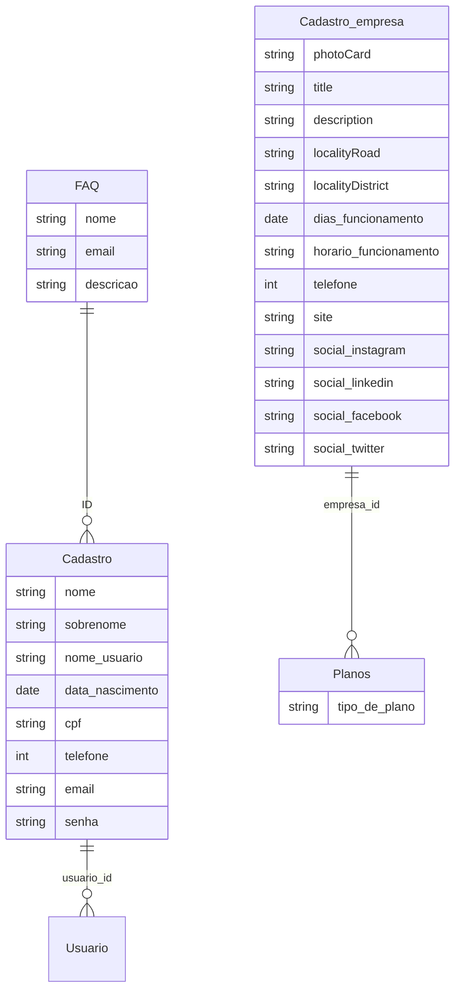
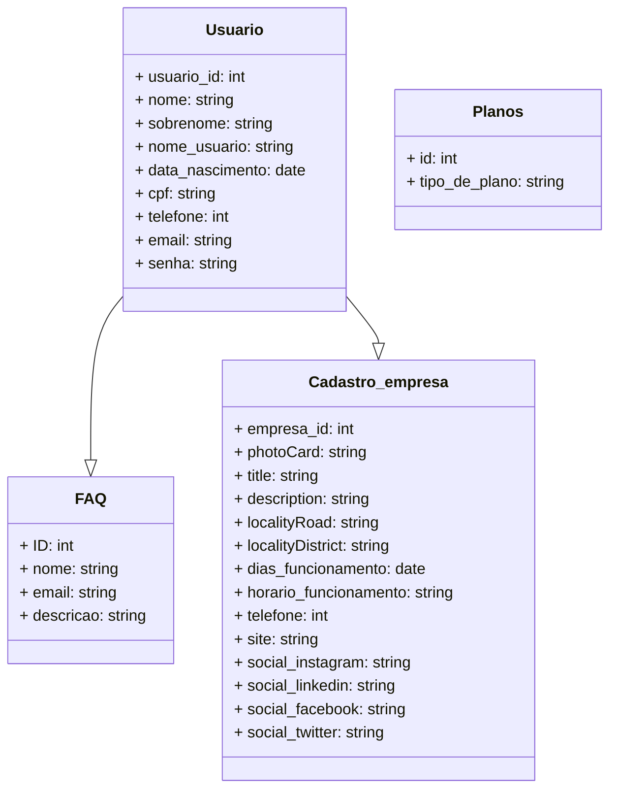

# DATABASE ComunIdeia

## modelo entidade-relacionamento (ER)

```mermaid

   erDiagram
    Cadastro ||--o{ Usuario : "usuario_id"
    Cadastro {
      string nome
      string sobrenome
      string nome_usuario
      date data_nascimento
      string cpf
      int telefone
      string email
      string senha
    }
    FAQ ||--o{ Cadastro : "ID"
    FAQ {
      string nome
      string email
      string descricao
    }
    Cadastro_empresa ||--o{ Planos : "empresa_id"
    Cadastro_empresa {
      string photoCard
      string title
      string description
      string localityRoad
      string localityDistrict
      date dias_funcionamento
      string horario_funcionamento
      int telefone
      string site
      string social_instagram
      string social_linkedin
      string social_facebook
      string social_twitter
    }
    Planos {
      string tipo_de_plano
    }
    
```

## Diagrama de classe

```mermaid

classDiagram
  class Usuario {
    + usuario_id: int
    + nome: string
    + sobrenome: string
    + nome_usuario: string
    + data_nascimento: date
    + cpf: string
    + telefone: int
    + email: string
    + senha: string
  }

  class FAQ {
    + ID: int
    + nome: string
    + email: string
    + descricao: string
  }

  class Cadastro_empresa {
    + empresa_id: int
    + photoCard: string
    + title: string
    + description: string
    + localityRoad: string
    + localityDistrict: string
    + dias_funcionamento: date
    + horario_funcionamento: string
    + telefone: int
    + site: string
    + social_instagram: string
    + social_linkedin: string
    + social_facebook: string
    + social_twitter: string
  }

  class Planos {
    + id: int
    + tipo_de_plano: string
  }

  Usuario --|> FAQ
  Usuario --|> Cadastro_empresa
```
