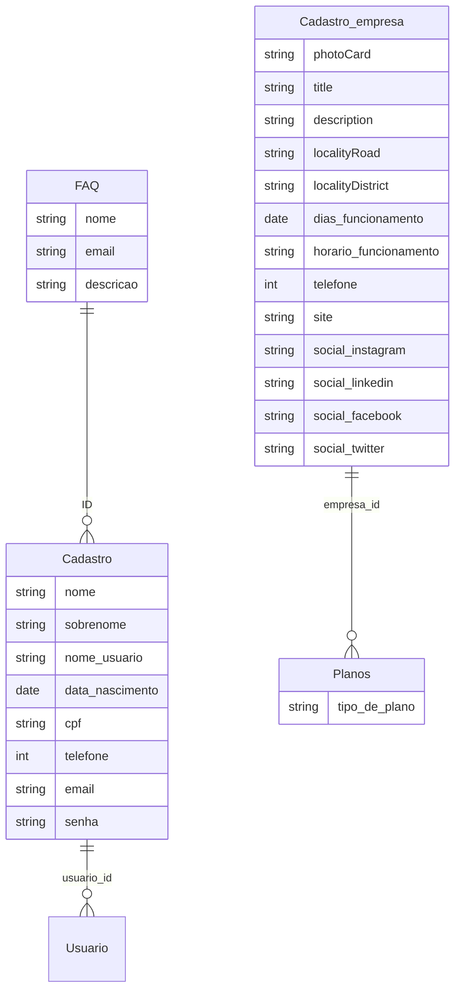

# DATABASE ComunIdeia

## exemplo em mermaid

```mermaid

   erDiagram
    Cadastro ||--o{ Usuario : "usuario_id"
    Cadastro {
      string nome
      string sobrenome
      string nome_usuario
      date data_nascimento
      string cpf
      int telefone
      string email
      string senha
    }
    FAQ ||--o{ Cadastro : "ID"
    FAQ {
      string nome
      string email
      string descricao
    }
    Cadastro_empresa ||--o{ Planos : "empresa_id"
    Cadastro_empresa {
      string photoCard
      string title
      string description
      string localityRoad
      string localityDistrict
      date dias_funcionamento
      string horario_funcionamento
      int telefone
      string site
      string social_instagram
      string social_linkedin
      string social_facebook
      string social_twitter
    }
    Planos {
      string tipo_de_plano
    }
    
```
